# Architecture Overview

<cite>
**Referenced Files in This Document**
- [Cargo.toml](file://Cargo.toml)
- [crates/velocity-core/src/lib.rs](file://crates/velocity-core/src/lib.rs)
- [crates/velocity-config/src/lib.rs](file://crates/velocity-config/src/lib.rs)
- [crates/velocity-compiler/src/lib.rs](file://crates/velocity-compiler/src/lib.rs)
- [crates/velocity-runtime/src/main.rs](file://crates/velocity-runtime/src/main.rs)
- [crates/velocity-ui/src/lib.rs](file://crates/velocity-ui/src/lib.rs)
- [crates/velocity-plugin-api/src/lib.rs](file://crates/velocity-plugin-api/src/lib.rs)
</cite>

## Table of Contents
1. [System Architecture](#system-architecture)
2. [Crate Responsibilities](#crate-responsibilities)
3. [Build Pipeline](#build-pipeline)
4. [Installation Execution Flow](#installation-execution-flow)
5. [UI Architecture](#ui-architecture)
6. [Security Architecture](#security-architecture)
7. [Plugin System Architecture](#plugin-system-architecture)
8. [Dependency Management Pipeline](#dependency-management-pipeline)
9. [Rollback and Error Recovery](#rollback-and-error-recovery)
10. [Data Flow](#data-flow)

## System Architecture

Velocity Installer is a 7-crate Rust workspace that produces standalone `.exe` installers from TOML configuration. The system is organized into three layers: build-time, runtime, and extensibility.

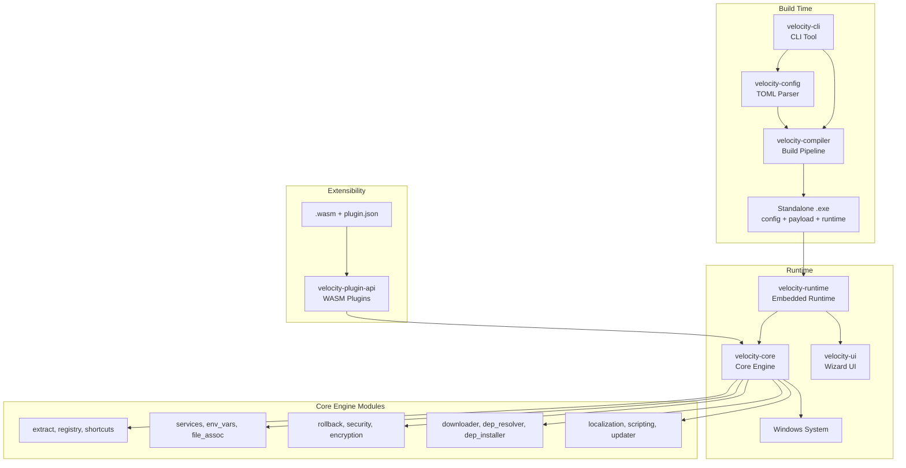

**Key Design Principles:**
- **Configuration-driven** — All installer behavior defined in `velocity.toml`
- **Standalone output** — Each installer is a single self-contained `.exe`
- **Automatic rollback** — All changes tracked and undone on failure
- **Security-first** — AES-256-GCM encryption, CSPRNG, path traversal protection
- **Dual UI** — Modern WebView2 or Classic Win32, selectable per package
- **Extensible** — WASM plugin system with sandboxed execution

## Crate Responsibilities

### velocity-cli (CLI Layer)
The user-facing command-line interface built with `clap`.

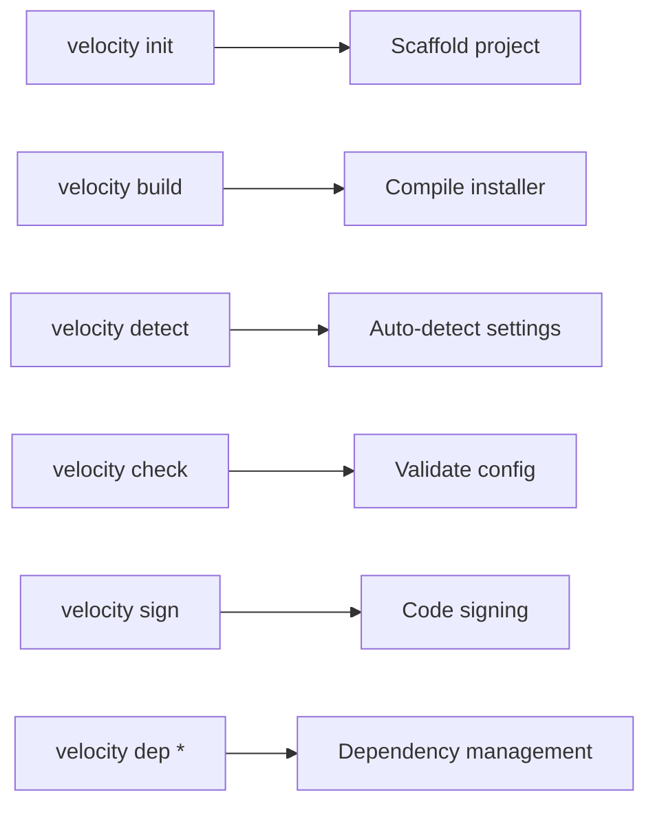

**Dependencies:** velocity-config, velocity-core, velocity-compiler, clap

### velocity-core (Engine Layer)
The heart of the installer with 37 modules covering all installation operations.

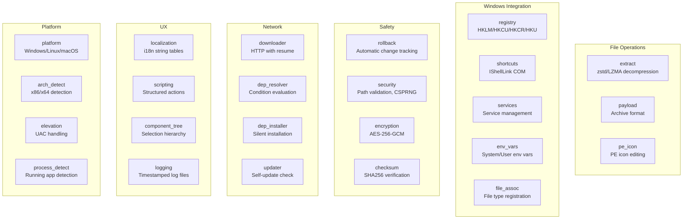

### velocity-config (Configuration Layer)
Handles TOML parsing, path variable resolution, and auto-generation.

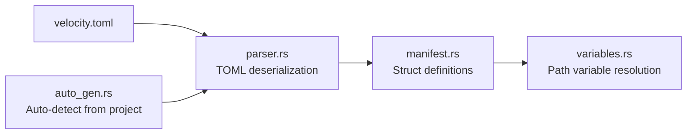

**Path Variables:**
| Variable | Resolves To |
|----------|-------------|
| `{app}` | Installation directory |
| `{autopf}` | Program Files (arch-aware) |
| `{win}` | Windows directory |
| `{sys}` | System32 directory |
| `{tmp}` | Temp directory |
| `{home}` | User home directory |
| `{desktop}` | Desktop folder |
| `{programs}` | Start Menu Programs |

### velocity-compiler (Build Layer)
Compiles configuration and payload into a standalone `.exe`.

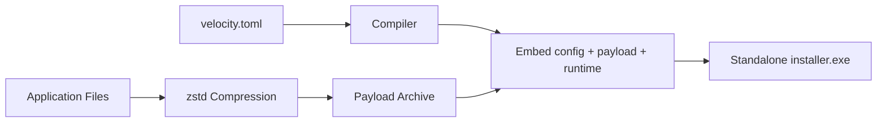

### velocity-runtime (Execution Layer)
Lightweight binary embedded in each installer `.exe`. Executes when the user runs the installer.

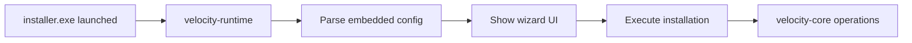

### velocity-ui (Presentation Layer)
Dual-theme wizard with progress tracking and ETA.

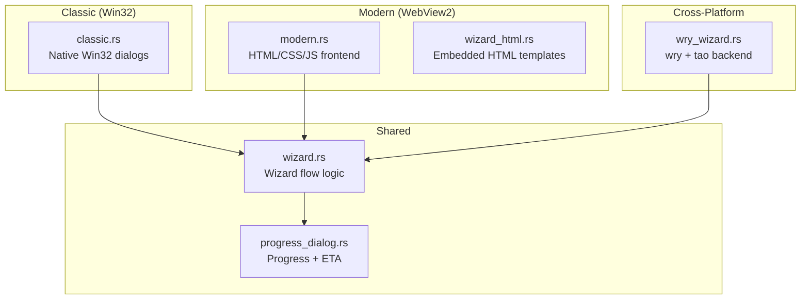

## Build Pipeline

### Compilation Flow

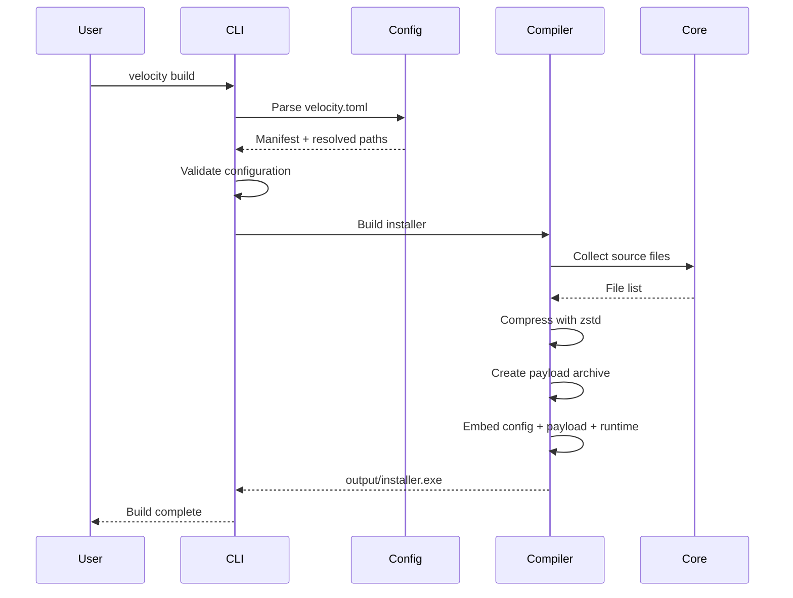

### Release Profile
```toml
[profile.release]
opt-level = "z"      # Optimize for size
lto = true            # Link-time optimization
codegen-units = 1     # Single codegen unit
strip = true          # Strip debug symbols
```

## Installation Execution Flow

### Runtime Execution

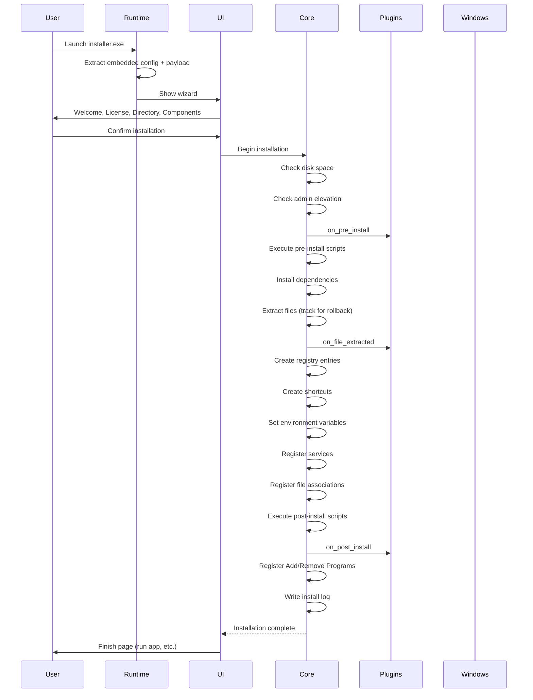

### Rollback on Failure

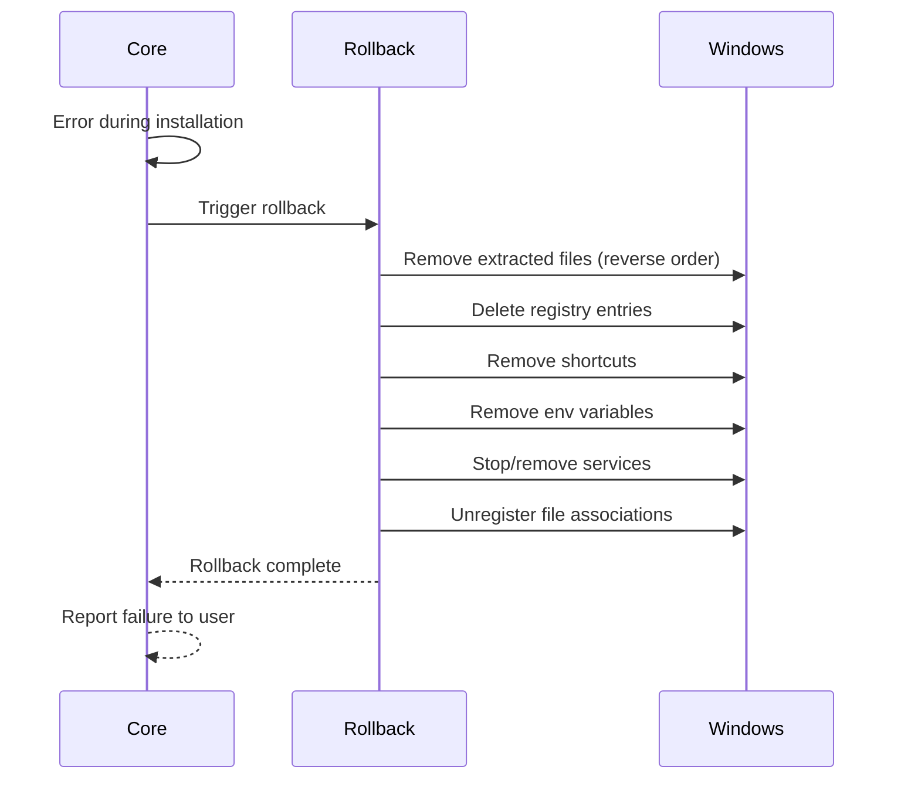

## UI Architecture

### Classic Wizard (Win32)
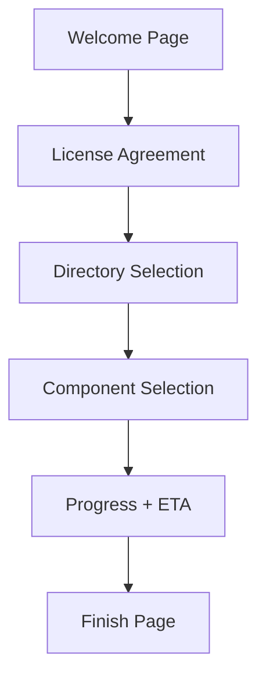

- Uses Win32 API via `windows` crate
- Native look and feel
- Windows-only

### Modern Wizard (WebView2)
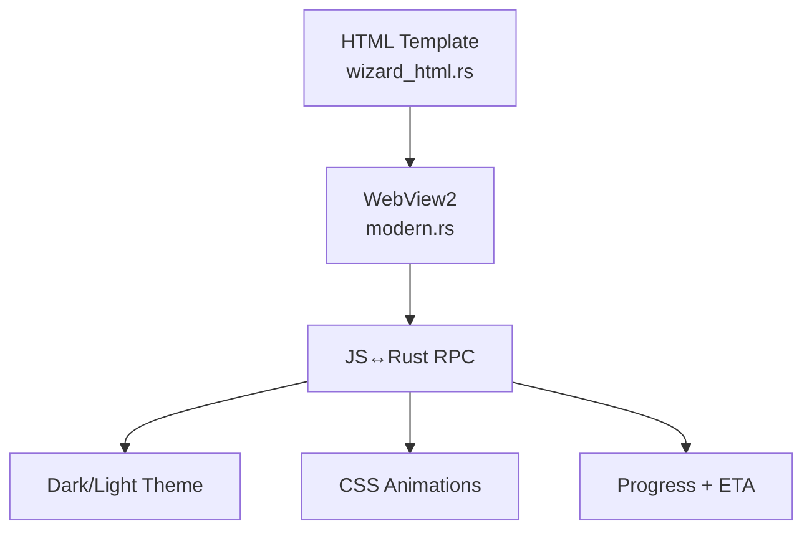

- Uses `webview2-com` crate
- Contemporary design with CSS animations
- Bidirectional JS↔Rust communication
- Windows-only (WebView2 required)

### Cross-Platform Wizard
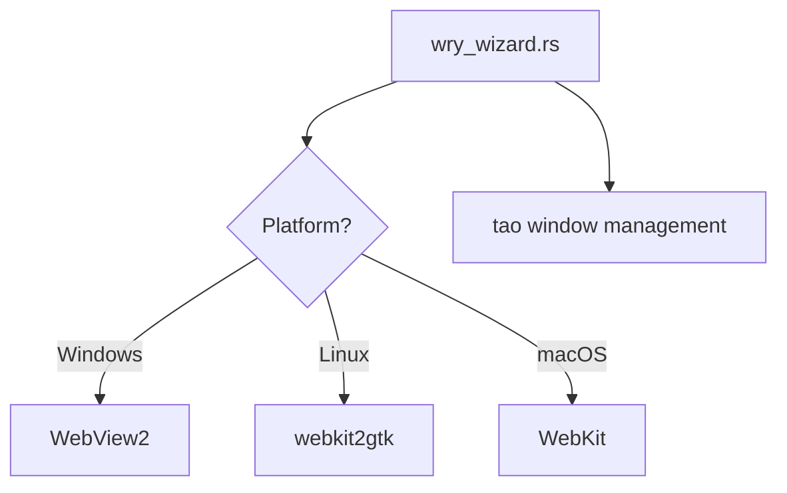

- Uses `wry` + `tao` crates
- Linux requires GTK + webkit2gtk
- macOS uses native WebKit

## Security Architecture

### Encryption Pipeline

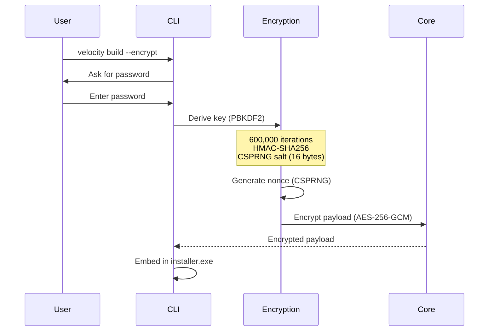

### Security Layers

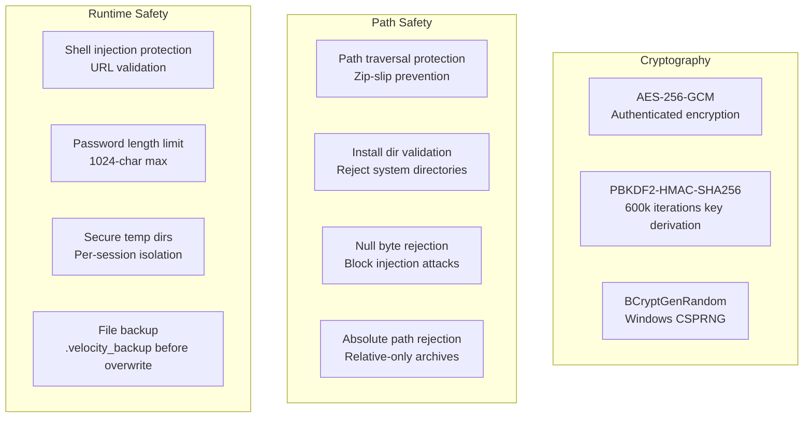

### Rejected Directories
The installer rejects these as installation targets:
- `C:\Windows`
- `C:\Windows\System32`
- `C:\ProgramData`
- Drive roots (`C:\`)
- Paths containing null bytes

## Plugin System Architecture

### WASM Plugin Pipeline

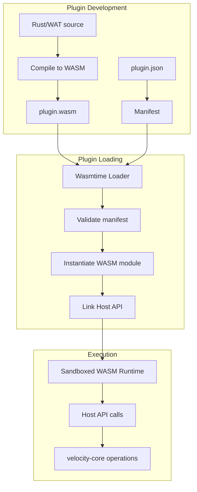

### Lifecycle Hooks
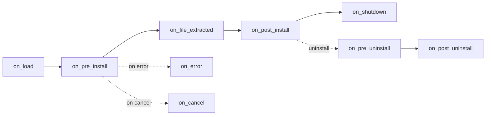

### Host API
Plugins can call these host functions:
- `log(message)` — Write to installer log
- `read_file(path)` — Read file contents
- `write_file(path, data)` — Write file
- `exec_command(cmd, args)` — Execute system command
- `registry_read(key)` — Read registry value
- `registry_write(key, value)` — Write registry value
- `set_progress(percent)` — Update progress bar
- `get_variable(name)` — Read path variable

## Dependency Management Pipeline

### Condition Resolution

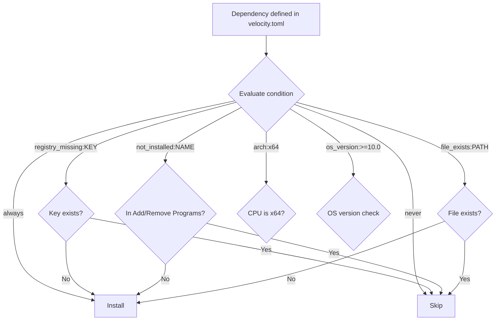

### Download and Install Flow

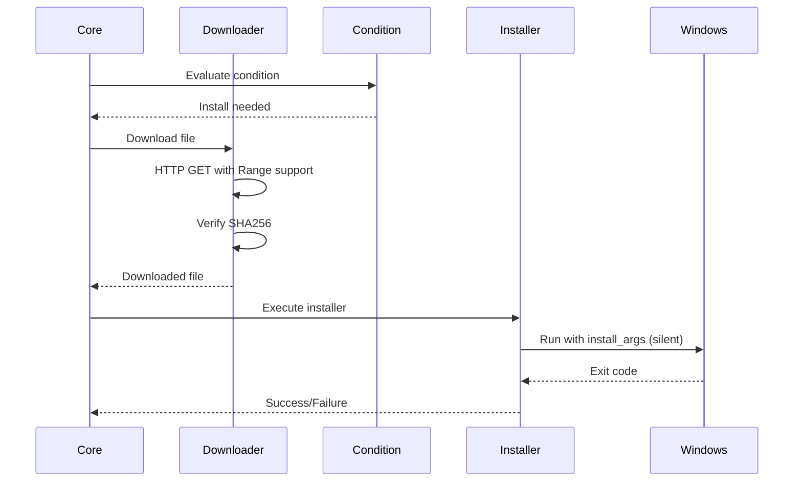

## Rollback and Error Recovery

### Transaction Tracking

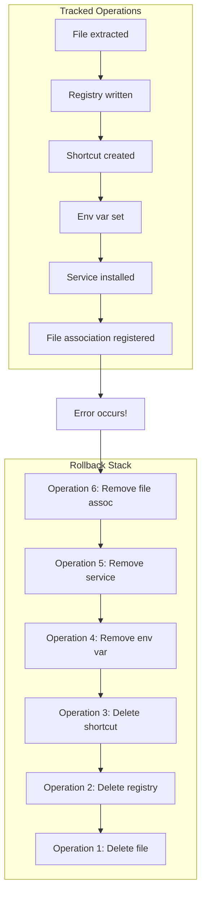

### Rollback Guarantees
- All file extractions are tracked and reversible
- Registry entries are deleted in reverse order
- Shortcuts are removed
- Environment variables are unset
- Services are stopped and removed
- File associations are unregistered
- Stress tested with 1000+ operations

## Data Flow

### Installer Build Data Flow

```mermaid
graph LR
    A[velocity.toml] --> B[Config Parser]
    C[Source Files] --> D[zstd Compressor]
    B --> E[Compiler]
    D --> F[Payload Archive]
    F --> E
    G[velocity-runtime] --> E
    E --> H[Standalone installer.exe]
```

### Installation Data Flow

```mermaid
graph LR
    A[installer.exe] --> B[Self-extract]
    B --> C[Embedded Config]
    B --> D[Compressed Payload]
    C --> E[Runtime]
    D --> F[zstd Decompress]
    F --> G[Extract Files]
    E --> H[Execute Installation]
    G --> H
    H --> I[Registry + Shortcuts + Services]
```

### Self-Update Data Flow

```mermaid
sequenceDiagram
    participant Runtime
    participant Updater
    participant Server

    Runtime->>Updater: Check for updates
    Updater->>Server: GET update-check.json
    Server-->>Updater: { version, url, sha256 }
    Updater->>Updater: Compare versions
    alt New version available
        Updater-->>Runtime: Update available
        Runtime-->>Runtime: Notify user
        Runtime->>Runtime: Open download URL
    else Up to date
        Updater-->>Runtime: No update needed
    end
```

**Section sources**
- [Cargo.toml](file://Cargo.toml)
- [crates/velocity-core/src/lib.rs](file://crates/velocity-core/src/lib.rs)
- [crates/velocity-config/src/lib.rs](file://crates/velocity-config/src/lib.rs)
- [crates/velocity-compiler/src/lib.rs](file://crates/velocity-compiler/src/lib.rs)
- [crates/velocity-runtime/src/main.rs](file://crates/velocity-runtime/src/main.rs)
- [crates/velocity-ui/src/lib.rs](file://crates/velocity-ui/src/lib.rs)
- [crates/velocity-plugin-api/src/lib.rs](file://crates/velocity-plugin-api/src/lib.rs)
