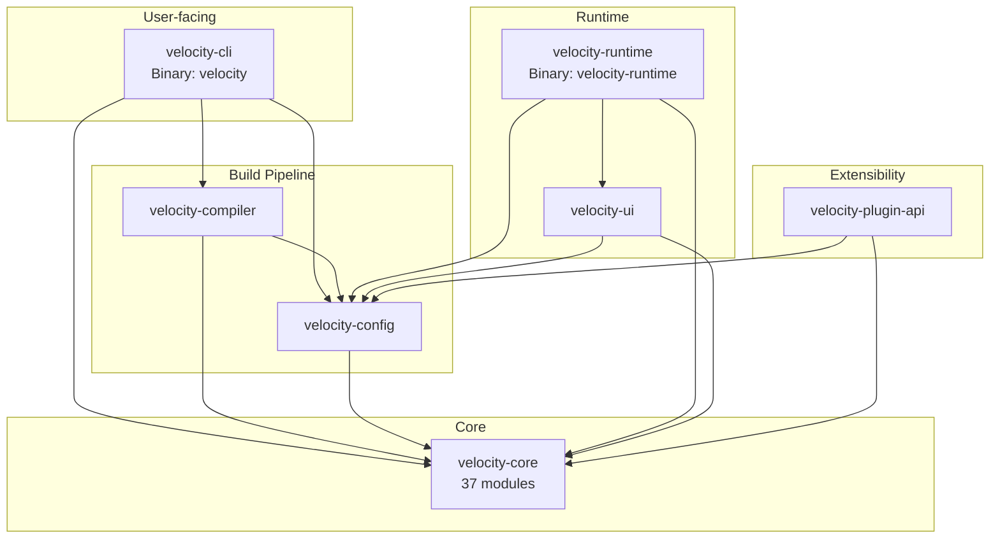
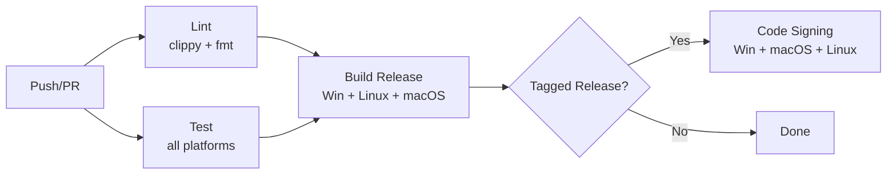

# Development Guide

<cite>
**Referenced Files in This Document**
- [Cargo.toml](file://Cargo.toml)
- [crates/velocity-cli/Cargo.toml](file://crates/velocity-cli/Cargo.toml)
- [crates/velocity-core/Cargo.toml](file://crates/velocity-core/Cargo.toml)
- [crates/velocity-core/src/lib.rs](file://crates/velocity-core/src/lib.rs)
- [crates/velocity-config/src/lib.rs](file://crates/velocity-config/src/lib.rs)
- [crates/velocity-ui/Cargo.toml](file://crates/velocity-ui/Cargo.toml)
- [crates/velocity-plugin-api/Cargo.toml](file://crates/velocity-plugin-api/Cargo.toml)
- [.github/workflows/ci.yml](file://.github/workflows/ci.yml)
</cite>

## Table of Contents
1. [Development Environment Setup](#development-environment-setup)
2. [Workspace Architecture](#workspace-architecture)
3. [Building and Testing](#building-and-testing)
4. [Code Style and Conventions](#code-style-and-conventions)
5. [Adding New Core Modules](#adding-new-core-modules)
6. [Adding New CLI Commands](#adding-new-cli-commands)
7. [Configuration System Development](#configuration-system-development)
8. [UI Development](#ui-development)
9. [Plugin Development](#plugin-development)
10. [Cross-Platform Considerations](#cross-platform-considerations)
11. [CI/CD with GitHub Actions](#cicd-with-github-actions)

## Development Environment Setup

### Prerequisites

**Rust Toolchain:**
```bash
rustup install stable
rustup default stable
# Minimum supported: Rust 1.75
cargo install cargo-watch cargo-edit
```

**Windows SDK:**
- Required for Windows-specific features (registry, shortcuts, services)
- Included with Visual Studio Build Tools

**WebView2 Runtime (optional, for modern UI):**
- Download from: https://developer.microsoft.com/en-us/microsoft-edge/webview2/

**Linux system dependencies (for cross-platform UI):**
```bash
sudo apt-get install -y libwebkit2gtk-4.1-dev libgtk-3-dev libappindicator3-dev
```

### IDE Setup

**VS Code Extensions:**
- rust-analyzer
- Even Better TOML
- CodeLLDB (for debugging)

**Settings (`.vscode/settings.json`):**
```json
{
  "rust-analyzer.checkOnSave.command": "clippy",
  "editor.formatOnSave": true,
  "[rust]": {
    "editor.defaultFormatter": "rust-lang.rust-analyzer"
  },
  "[toml]": {
    "editor.defaultFormatter": "tamasfe.even-better-toml"
  }
}
```

## Workspace Architecture

### Crate Dependency Graph



### Crate Responsibilities

| Crate | Responsibility | Key Types |
|-------|---------------|-----------|
| `velocity-cli` | CLI interface, command dispatch | `Commands` enum (clap) |
| `velocity-core` | All installation operations | 37 public modules |
| `velocity-config` | TOML parsing, path variables | `Manifest`, `VelocityConfig` |
| `velocity-ui` | Wizard UI (classic + modern) | `Wizard`, `ProgressDialog` |
| `velocity-compiler` | Build standalone .exe | `Builder` |
| `velocity-runtime` | Execute installer at runtime | Platform-specific main |
| `velocity-plugin-api` | WASM plugin trait + loader | `Plugin` trait, `WasmLoader` |

## Building and Testing

### Build All
```bash
cargo build --release
```

### Build Specific Crate
```bash
cargo build -p velocity-core --release
cargo build -p velocity-cli --release
cargo build -p velocity-runtime --release
```

### Run Tests
```bash
# All workspace tests
cargo test --workspace

# Specific crate
cargo test -p velocity-core
cargo test -p velocity-config
cargo test -p velocity-compiler
cargo test -p velocity-plugin-api

# E2E tests (ignored by default)
cargo test --workspace -- --include-ignored
```

### Development Mode
```bash
cargo watch -x "run -p velocity-cli --"
```

## Code Style and Conventions

### Formatting
```bash
cargo fmt --all
```

### Linting
```bash
cargo clippy --workspace --all-targets -- -D warnings
```

### Rust Conventions
- Use `snake_case` for functions, variables, modules
- Use `PascalCase` for types, traits
- Use `UPPER_SNAKE_CASE` for constants
- Document public APIs with `///` comments
- Use `#[must_use]` for functions returning Results
- Prefer `?` operator over `.unwrap()` in library code
- Use `thiserror` for library errors, `anyhow` for application errors

### Error Handling Pattern
```rust
// Library code (velocity-core, velocity-config, etc.)
use thiserror::Error;

#[derive(Error, Debug)]
pub enum MyCrateError {
    #[error("Invalid configuration: {0}")]
    Config(String),

    #[error("IO error: {0}")]
    Io(#[from] std::io::Error),

    #[error("Windows API error: {0}")]
    Windows(u32),
}

// Application code (velocity-cli, velocity-runtime)
use anyhow::{Context, Result};

fn do_something() -> Result<()> {
    let config = load_config()
        .context("Failed to load configuration")?;
    Ok(())
}
```

### Module Organization
```rust
// crates/velocity-core/src/lib.rs
pub mod new_module;       // Public module
pub use error::*;         // Re-export error types
```

## Adding New Core Modules

### Step 1: Create the Module
```rust
// crates/velocity-core/src/new_feature.rs
//! New feature implementation.

use crate::error::VelocityError;

pub struct NewFeature {
    // fields
}

impl NewFeature {
    pub fn new() -> Self {
        Self { /* ... */ }
    }

    pub fn execute(&self) -> Result<(), VelocityError> {
        // implementation
        Ok(())
    }
}

#[cfg(test)]
mod tests {
    use super::*;

    #[test]
    fn test_new_feature() {
        // tests
    }
}
```

### Step 2: Register in lib.rs
```rust
// crates/velocity-core/src/lib.rs
pub mod new_feature;
```

### Step 3: Add Dependencies (if needed)
```toml
# crates/velocity-core/Cargo.toml
[dependencies]
new_dep = { workspace = true }
```

### Step 4: Add to Workspace Dependencies (if new)
```toml
# Cargo.toml (workspace root)
[workspace.dependencies]
new_dep = "1.0"
```

## Adding New CLI Commands

### Step 1: Add Command Variant
```rust
// crates/velocity-cli/src/main.rs
#[derive(Subcommand)]
enum Commands {
    // existing commands...
    /// Description of new command
    NewCommand {
        #[arg(short, long)]
        option: Option<String>,
    },
}
```

### Step 2: Implement Command Handler
```rust
// crates/velocity-cli/src/commands/new_command.rs
use anyhow::Result;

pub fn execute(option: Option<String>) -> Result<()> {
    // implementation
    Ok(())
}
```

### Step 3: Register in mod.rs
```rust
// crates/velocity-cli/src/commands/mod.rs
pub mod new_command;
```

### Step 4: Wire Up in main.rs
```rust
match &cli.command {
    Commands::NewCommand { option } => {
        commands::new_command::execute(option.clone())?;
    }
    // ...
}
```

## Configuration System Development

### velocity.toml Schema
The configuration is defined in `velocity-config/src/manifest.rs`:

```rust
#[derive(Debug, Serialize, Deserialize)]
pub struct Manifest {
    pub app: AppConfig,
    pub install: InstallConfig,
    pub files: FilesConfig,
    #[serde(default)]
    pub components: Vec<Component>,
    #[serde(default)]
    pub dependencies: Vec<Dependency>,
    // ... more sections
}
```

### Adding a New Config Section
1. Define the struct in `manifest.rs`
2. Add field to `Manifest` struct
3. Add parsing tests in `parser.rs`
4. Update `auto_gen.rs` if auto-detectable
5. Update `variables.rs` if new path variables needed

### Path Variables
Defined in `velocity-config/src/variables.rs`:
```rust
pub fn resolve_variable(var: &str, context: &PathContext) -> Option<String> {
    match var {
        "app" => Some(context.install_dir.to_string_lossy().to_string()),
        "autopf" => Some(auto_program_files()),
        "win" => Some(windows_dir()),
        "sys" => Some(system32_dir()),
        "tmp" => Some(temp_dir()),
        "home" => Some(home_dir()),
        // add new variables here
        _ => None,
    }
}
```

## UI Development

### Classic UI (Win32)
Located in `crates/velocity-ui/src/classic.rs`:
- Uses Win32 API directly via `windows` crate
- Native dialog pages: Welcome, License, Directory, Components, Progress, Finish
- Windows-only

### Modern UI (WebView2)
Located in `crates/velocity-ui/src/modern.rs`:
- Uses `webview2-com` crate
- HTML/CSS/JS frontend with JS↔Rust bidirectional RPC
- Dark/light theme support
- CSS animations
- Windows-only (WebView2 required)

### Cross-Platform UI
Located in `crates/velocity-ui/src/wry_wizard.rs`:
- Uses `wry` + `tao` crates
- Linux: requires webkit2gtk
- macOS: uses native WebKit

### Adding a New Wizard Page
1. Add page struct implementing wizard page trait
2. Register in wizard flow
3. Add HTML template (modern) or Win32 dialog (classic)
4. Add localization strings

## Plugin Development

### Plugin Trait
Defined in `crates/velocity-plugin-api/src/plugin.rs`:

```rust
pub trait Plugin {
    fn on_load(&mut self, ctx: &PluginContext) -> Result<()>;
    fn on_pre_install(&mut self, ctx: &PluginContext) -> Result<()>;
    fn on_file_extracted(&mut self, ctx: &PluginContext, path: &str) -> Result<()>;
    fn on_post_install(&mut self, ctx: &PluginContext) -> Result<()>;
    fn on_error(&mut self, ctx: &PluginContext, error: &str) -> Result<()>;
    fn on_cancel(&mut self, ctx: &PluginContext) -> Result<()>;
    fn on_pre_uninstall(&mut self, ctx: &PluginContext) -> Result<()>;
    fn on_post_uninstall(&mut self, ctx: &PluginContext) -> Result<()>;
    fn on_shutdown(&mut self, ctx: &PluginContext) -> Result<()>;
}
```

### WASM Plugin Structure
```
my-plugin/
├── plugin.json    # Manifest (name, version, hooks)
└── plugin.wasm    # Compiled WASM module
```

### Building a WASM Plugin
```bash
# Compile Rust to WASM
cargo build --target wasm32-wasi --release

# Or compile WAT (WebAssembly Text) to WASM
wat2wasm plugin.wat -o plugin.wasm
```

### Host API
Plugins can access:
- Logging
- File read/write
- Command execution
- Registry access
- Progress updates

## Cross-Platform Considerations

### Windows-Only Features
These modules are Windows-specific (guarded by `cfg(target_os = "windows")`):
- `registry` — Windows Registry
- `shortcuts` — IShellLink COM shortcuts
- `services` — Windows Service management
- `elevation` — UAC elevation
- `file_assoc` — File type associations
- `pe_icon` — PE executable icon editing

### Cross-Platform Modules
These work on all platforms:
- `extract` — File extraction (zstd, LZMA)
- `checksum` — SHA256 verification
- `downloader` — HTTP downloads
- `encryption` — AES-256-GCM
- `localization` — i18n string tables
- `rollback` — Change tracking and rollback
- `security` — Path validation, traversal protection

### Platform Guards
```rust
// Windows-only code
#[cfg(target_os = "windows")]
pub fn windows_specific() { /* ... */ }

// Unix-only code
#[cfg(not(target_os = "windows"))]
pub fn unix_specific() { /* ... */ }
```

## CI/CD with GitHub Actions

### Pipeline Overview
The CI pipeline (`.github/workflows/ci.yml`) runs on every push/PR:



### CI Matrix
| OS | Versions |
|----|----------|
| Windows | 2025, 2022 |
| Ubuntu | 24.04, 22.04 |
| macOS | 15, 14 |

### Code Signing
On tagged releases:
- **Windows:** signtool.exe with SHA1 fingerprint
- **macOS:** codesign with Developer ID certificate
- **Linux:** GPG signatures

### Running CI Locally
```bash
# Check formatting
cargo fmt --all -- --check

# Run clippy
cargo clippy --workspace -- -D warnings

# Run all tests
cargo test --workspace -- --include-ignored
```

## Common Development Tasks

### Updating Dependencies
```bash
cargo update           # Update Cargo.lock
cargo upgrade          # Update Cargo.toml (with cargo-edit)
```

### Debug Logging
```bash
# Enable debug logging
RUST_LOG=debug cargo run --bin velocity -- build

# Enable trace logging
RUST_LOG=trace cargo run --bin velocity -- build
```

### Adding Tests
```rust
#[cfg(test)]
mod tests {
    use super::*;

    #[test]
    fn test_feature_basic() {
        // basic functionality
    }

    #[test]
    fn test_feature_edge_cases() {
        // edge cases, empty input, unicode, etc.
    }

    #[test]
    fn test_feature_error_handling() {
        // error conditions
    }
}
```

**Section sources**
- [Cargo.toml](file://Cargo.toml)
- [crates/velocity-core/src/lib.rs](file://crates/velocity-core/src/lib.rs)
- [crates/velocity-config/src/lib.rs](file://crates/velocity-config/src/lib.rs)
- [.github/workflows/ci.yml](file://.github/workflows/ci.yml)
