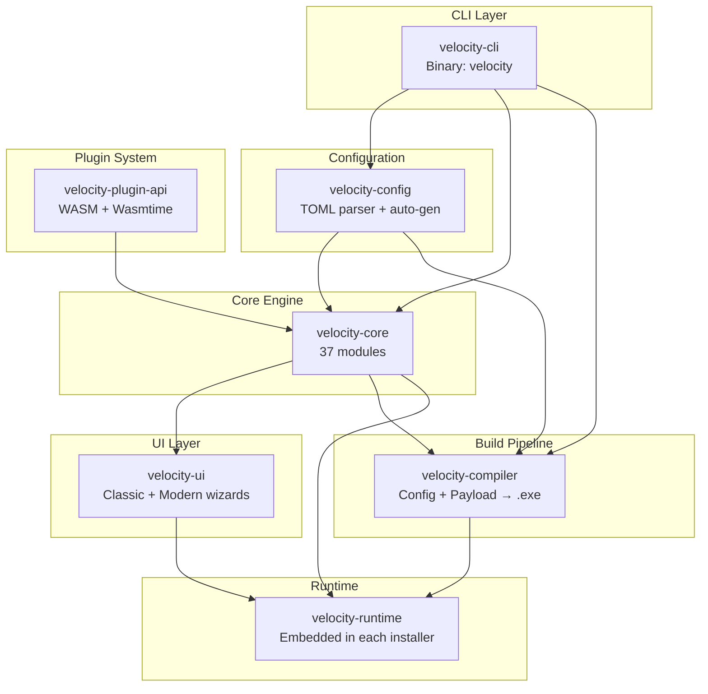

# Getting Started

<cite>
**Referenced Files in This Document**
- [README.md](file://README.md)
- [Cargo.toml](file://Cargo.toml)
- [crates/velocity-cli/src/main.rs](file://crates/velocity-cli/src/main.rs)
- [crates/velocity-core/src/lib.rs](file://crates/velocity-core/src/lib.rs)
- [crates/velocity-runtime/src/main.rs](file://crates/velocity-runtime/src/main.rs)
- [examples/sample-app/velocity.toml](file://examples/sample-app/velocity.toml)
</cite>

## Table of Contents
1. [Introduction](#introduction)
2. [Project Structure](#project-structure)
3. [Core Components](#core-components)
4. [Installation and Setup](#installation-and-setup)
5. [Building from Source](#building-from-source)
6. [CLI Commands](#cli-commands)
7. [Sample Installer Project](#sample-installer-project)
8. [Testing](#testing)
9. [Troubleshooting](#troubleshooting)

## Introduction

V.E.L.O.C.I.T.Y. Installer is a free, open-source, universal Windows installer framework built in Rust. It produces standalone `.exe` installers from a simple TOML configuration, with a choice of modern or classic wizard UI. No commercial licensing required — fully free under MIT/Apache-2.0.

**Key capabilities:**
- **High-performance Rust engine** — Built for maximum performance and minimal binary size
- **zstd compression** — Fast, efficient payload compression (up to 90%+ reduction)
- **Standalone .exe output** — Each installer is a single self-contained executable
- **Modern or Classic UI** — WebView2 wizard with dark/light themes, or native Win32 wizard
- **Silent mode** — Inno Setup compatible unattended installation (`/S`, `/D=path`)
- **Automatic rollback** — All changes tracked and undone if installation fails
- **WASM plugins** — Extend installer behavior with sandboxed WebAssembly modules
- **AES-256-GCM encryption** — Authenticated encryption for installer payloads
- **Ninite-like dependencies** — Auto-download and silently install prerequisites
- **Built-in i18n** — Multi-language support with per-string overrides

## Project Structure

```
V.E.L.O.C.I.T.Y.-Installer/
├── crates/
│   ├── velocity-cli/          # CLI: init, build, detect, check, info, sign, dep
│   ├── velocity-core/         # Engine: extract, registry, shortcuts, services,
│   │                          #        rollback, logging, disk space, file associations,
│   │                          #        process detection, PE icon, elevation, payload,
│   │                          #        downloader, dep resolver, dep installer,
│   │                          #        localization, security, encryption (AES-256-GCM),
│   │                          #        updater, component tree, scripting engine
│   ├── velocity-config/       # Config parser, validator, auto-gen, path variables
│   ├── velocity-ui/           # Wizard UI with progress tracking + ETA
│   ├── velocity-compiler/     # Compiles config+payload into standalone .exe
│   ├── velocity-runtime/      # Lightweight runtime embedded in each installer
│   └── velocity-plugin-api/   # Plugin trait + SDK for custom actions
├── examples/
│   ├── sample-app/            # Full sample installer project
│   └── sample-plugin/         # WASM plugin example
├── docs/                      # Security audits and code signing docs
├── scripts/                   # Build and signing scripts
├── .github/workflows/         # CI/CD pipelines
└── Cargo.toml                 # Workspace root
```



**Diagram sources**
- [Cargo.toml](file://Cargo.toml)
- [crates/velocity-cli/Cargo.toml](file://crates/velocity-cli/Cargo.toml)
- [crates/velocity-core/Cargo.toml](file://crates/velocity-core/Cargo.toml)

## Core Components

### velocity-cli (CLI Tool)
The command-line interface for scaffolding, building, and managing installer projects.

**Key files:**
- `crates/velocity-cli/src/main.rs` — Entry point with clap argument parsing
- `crates/velocity-cli/src/commands/` — Individual command implementations (build, check, detect, info, sign, dep, init, update)

### velocity-core (Core Engine)
The heart of the installer — handles all installation operations.

**37 modules covering:**
- File extraction with zstd/LZMA compression
- Windows registry operations (HKLM, HKCU, HKCR, HKU)
- Shortcut creation via IShellLink COM
- Windows service management
- Environment variable management
- Automatic rollback on failure
- AES-256-GCM encryption/decryption
- HTTP downloading with resume support
- Dependency condition resolution
- Localization (i18n)
- Structured scripting engine
- Security hardening (path traversal, CSPRNG, etc.)

### velocity-config (Configuration)
Parses `velocity.toml` files and resolves path variables.

**Key files:**
- `crates/velocity-config/src/parser.rs` — TOML parsing
- `crates/velocity-config/src/variables.rs` — Path variable resolution
- `crates/velocity-config/src/auto_gen.rs` — Auto-detect project settings
- `crates/velocity-config/src/manifest.rs` — Manifest structure definitions

### velocity-ui (Wizard UI)
Dual-theme installer wizard with progress tracking.

**Key files:**
- `crates/velocity-ui/src/classic.rs` — Native Win32 wizard
- `crates/velocity-ui/src/modern.rs` — WebView2 modern wizard
- `crates/velocity-ui/src/wizard.rs` — Shared wizard logic
- `crates/velocity-ui/src/progress_dialog.rs` — Progress with ETA
- `crates/velocity-ui/src/wry_wizard.rs` — Cross-platform wizard (wry+tao)

### velocity-compiler (Build Pipeline)
Compiles configuration and payload into standalone `.exe` installers.

**Key files:**
- `crates/velocity-compiler/src/builder.rs` — Build pipeline
- `crates/velocity-compiler/src/lib.rs` — Compiler interface

### velocity-runtime (Embedded Runtime)
Lightweight runtime that executes when the installer .exe is launched.

**Key files:**
- `crates/velocity-runtime/src/main.rs` — Runtime entry point
- `crates/velocity-runtime/src/windows.rs` — Windows-specific execution
- `crates/velocity-runtime/src/unix.rs` — Unix-specific execution

### velocity-plugin-api (WASM Plugins)
Plugin trait and SDK for extending installer behavior.

**Key files:**
- `crates/velocity-plugin-api/src/plugin.rs` — Plugin trait with 9 lifecycle hooks
- `crates/velocity-plugin-api/src/loader.rs` — Wasmtime-based WASM loader

## Installation and Setup

### Prerequisites
- Rust toolchain (stable, version 1.75+)
- Windows SDK (for Windows-specific features)
- WebView2 Runtime (for modern UI, optional)

### Setup

1. **Clone the repository**
   ```bash
   git clone https://github.com/UnitBuilds-CC/V.E.L.O.C.I.T.Y.-Installer.git
   cd V.E.L.O.C.I.T.Y.-Installer
   ```

2. **Build the workspace**
   ```bash
   cargo build --release
   ```

3. **Install the CLI globally**
   ```bash
   cargo install --path crates/velocity-cli
   ```

## Building from Source

### Full Build
```bash
cargo build --release
```

The release profile is optimized for minimal binary size:
- `opt-level = "z"` (size optimization)
- `lto = true` (link-time optimization)
- `codegen-units = 1` (single codegen unit)
- `strip = true` (strip debug symbols)

### Build Specific Crate
```bash
cargo build -p velocity-core --release
cargo build -p velocity-cli --release
cargo build -p velocity-runtime --release
```

### Output Binaries
- `target/release/velocity.exe` — CLI tool
- `target/release/velocity-runtime.exe` — Runtime binary

## CLI Commands

| Command | Description |
|---------|-------------|
| `velocity init [name]` | Scaffold a new installer project |
| `velocity build` | Build the installer .exe |
| `velocity detect` | Auto-detect project settings from Cargo.toml/package.json |
| `velocity check` | Deep validation of velocity.toml |
| `velocity info <path>` | Show installer package info |
| `velocity sign <path>` | Code-sign the installer (wraps signtool.exe) |
| `velocity dep list` | List configured dependencies |
| `velocity dep add` | Add a new dependency |
| `velocity dep resolve` | Check which dependencies need installation |
| `velocity dep remove` | Remove a dependency |
| `velocity version` | Show version info |

### Quick Start Workflow
```bash
# 1. Create a new installer project
velocity init my-app

# 2. Auto-detect settings from your project
velocity detect

# 3. Validate configuration
velocity check

# 4. Build the installer
cd my-app
velocity build

# 5. Sign the installer (optional)
velocity sign output/installer.exe --fingerprint YOUR_THUMBPRINT
```

## Sample Installer Project

The `examples/sample-app/` directory contains a complete sample installer project that exercises all major features:

**Sample features demonstrated:**
- Multi-component selection (core, docs, SDK, samples)
- Remote dependency installation (VC++ Redistributable)
- Registry entries (HKLM, HKCU)
- Environment variables
- File associations
- Pre/post-install scripts
- Structured post-install actions (mkdir, copy with conditions)
- Localization (English, German, Spanish, French, Japanese)
- Silent installation support
- Self-update via JSON endpoint

**Building the sample:**
```bash
cd examples/sample-app
velocity build
```

**Testing the sample installer:**
```cmd
# Silent install
output\installer.exe /S /D=C:\TestInstall

# Uninstall
output\installer.exe --uninstall --force
```

## Testing

### Run All Tests
```bash
cargo test --workspace
```

### Run Specific Crate Tests
```bash
cargo test -p velocity-core
cargo test -p velocity-config
cargo test -p velocity-compiler
cargo test -p velocity-plugin-api
```

### Run E2E Tests
```bash
cargo test --workspace -- --include-ignored
```

### Test Coverage (213+ tests)
- Config parsing and validation: 14 tests
- Archive creation and extraction: 3 tests
- Rollback tracking: 3 tests
- Security (path traversal, overwrite): 8 tests
- AES-256-GCM encryption + CSPRNG: 12 tests
- Localization: 10 tests
- Scripting engine: 13 tests
- WASM plugin API + loader: 15 tests
- And many more (see README.md for full list)

## Troubleshooting

### Common Issues

**Rust compilation errors**
- Update toolchain: `rustup update stable`
- Clean build: `cargo clean && cargo build --release`
- Ensure Rust 1.75+ is installed

**WebView2 not found (modern UI)**
- Install WebView2 Runtime: https://developer.microsoft.com/en-us/microsoft-edge/webview2/
- Or use classic UI: `theme = "classic"` in velocity.toml

**Windows API errors**
- Ensure Windows SDK is installed
- Check that you're building on Windows (some features are Windows-only)

**Code signing fails**
- Ensure signtool.exe is available (comes with Windows SDK)
- Verify certificate fingerprint is correct
- Check timestamp server URL is accessible

**Build produces large binary**
- Ensure release profile is used: `cargo build --release`
- Release profile uses `opt-level = "z"`, LTO, and stripping

### Getting Help
- Check the [docs/](file://docs) directory for security audits and code signing docs
- Review the [examples/](file://examples) directory for working examples
- Examine CI configuration in [.github/workflows/](file://.github/workflows)

**Section sources**
- [README.md](file://README.md)
- [Cargo.toml](file://Cargo.toml)
- [crates/velocity-cli/src/main.rs](file://crates/velocity-cli/src/main.rs)
- [examples/sample-app/velocity.toml](file://examples/sample-app/velocity.toml)
