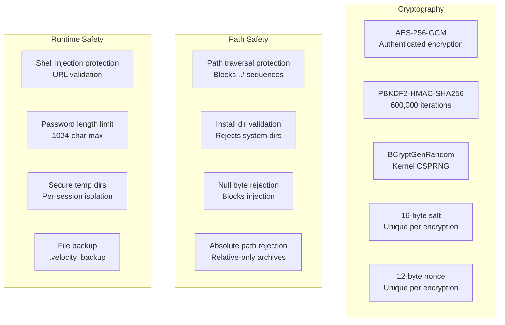

The Velocity Installer implements comprehensive security hardening including AES-256-GCM authenticated encryption, PBKDF2 key derivation, and multiple layers of protection against common attacks.

**Architecture:**
- **AES-256-GCM** — Authenticated encryption (confidentiality + integrity)
- **PBKDF2-HMAC-SHA256** — 600,000 iterations for password-based key derivation (OWASP 2023)
- **BCryptGenRandom** — Windows kernel-level CSPRNG for all cryptographic randomness
- **Defense in depth** — Multiple independent security layers

**Encryption Pipeline:**
```rust
// crates/velocity-core/src/encryption.rs

// Key derivation
pub fn derive_key(password: &str, salt: &[u8]) -> Result<[u8; 32]> {
    let mut key = [0u8; 32];
    pbkdf2_hmac::<Sha256>(
        password.as_bytes(),
        salt,
        600_000,        // OWASP 2023 recommendation
        &mut key,
    );
    Ok(key)
}

// Encryption
pub fn encrypt_payload(payload: &[u8], password: &str) -> Result<EncryptedPayload> {
    // 1. Generate CSPRNG salt (16 bytes)
    let mut salt = [0u8; 16];
    generate_random(&mut salt)?;  // BCryptGenRandom on Windows

    // 2. Derive key from password
    let key = derive_key(password, &salt)?;

    // 3. Generate CSPRNG nonce (12 bytes for AES-GCM)
    let mut nonce = [0u8; 12];
    generate_random(&mut nonce)?;

    // 4. Encrypt with AES-256-GCM
    let cipher = Aes256Gcm::new_from_slice(&key)?;
    let ciphertext = cipher.encrypt(
        Nonce::from_slice(&nonce),
        payload
    )?;

    Ok(EncryptedPayload {
        salt,
        nonce,
        ciphertext,
    })
}

// Decryption
pub fn decrypt_payload(encrypted: &EncryptedPayload, password: &str) -> Result<Vec<u8>> {
    let key = derive_key(password, &encrypted.salt)?;
    let cipher = Aes256Gcm::new_from_slice(&key)?;
    let plaintext = cipher.decrypt(
        Nonce::from_slice(&encrypted.nonce),
        encrypted.ciphertext.as_ref()
    )?;
    Ok(plaintext)
}
```

**CSPRNG (Random Number Generation):**
```rust
// crates/velocity-core/src/encryption.rs

#[cfg(target_os = "windows")]
pub fn generate_random(buf: &mut [u8]) -> Result<()> {
    use windows::Win32::Security::Cryptography::BCryptGenRandom;
    // Windows kernel-level CSPRNG
    unsafe {
        BCryptGenRandom(
            None,
            buf,
            BCryptGenRandomFlags::default(),
        )?;
    }
    Ok(())
}

#[cfg(not(target_os = "windows"))]
pub fn generate_random(buf: &mut [u8]) -> Result<()> {
    use getrandom::getrandom;
    getrandom(buf)?;
    Ok(())
}
```

**Security Layers:**



**Path Traversal Protection:**
```rust
// crates/velocity-core/src/security.rs
pub fn validate_archive_entry(path: &str) -> Result<()> {
    // Reject absolute paths
    if Path::new(path).is_absolute() {
        return Err(SecurityError::AbsolutePath(path.to_string()));
    }

    // Reject path traversal (../)
    let normalized = normalize_path(path);
    if normalized.contains("..") {
        return Err(SecurityError::PathTraversal(path.to_string()));
    }

    // Reject null bytes
    if path.contains('\0') {
        return Err(SecurityError::NullByte(path.to_string()));
    }

    Ok(())
}
```

**Install Directory Validation:**
```rust
// crates/velocity-core/src/security.rs
pub fn validate_install_dir(dir: &Path) -> Result<()> {
    let canonical = dir.canonicalize()?;

    // Reject Windows system directories
    let rejected = [
        r"C:\Windows",
        r"C:\Windows\System32",
        r"C:\ProgramData",
    ];

    for blocked in &rejected {
        if canonical.starts_with(blocked) {
            return Err(SecurityError::SystemDirectory(blocked.to_string()));
        }
    }

    // Reject drive roots
    if canonical.parent().is_none() {
        return Err(SecurityError::DriveRoot);
    }

    // Reject paths with null bytes
    let path_str = canonical.to_string_lossy();
    if path_str.contains('\0') {
        return Err(SecurityError::NullByte);
    }

    Ok(())
}
```

**Shell Injection Protection:**
```rust
// crates/velocity-core/src/security.rs
pub fn validate_url(url: &str) -> Result<()> {
    // Must be http or https
    if !url.starts_with("http://") && !url.starts_with("https://") {
        return Err(SecurityError::InvalidUrl(url.to_string()));
    }

    // Reject URLs with shell metacharacters
    let dangerous = ['&', '|', ';', '`', '$', '(', ')', '{', '}'];
    for ch in dangerous {
        if url.contains(ch) {
            return Err(SecurityError::ShellInjection(url.to_string()));
        }
    }

    Ok(())
}
```

**Password Security:**
```rust
// Password length limit prevents PBKDF2 DoS
pub const MAX_PASSWORD_LENGTH: usize = 1024;

pub fn validate_password(password: &str) -> Result<()> {
    if password.len() > MAX_PASSWORD_LENGTH {
        return Err(SecurityError::PasswordTooLong(password.len()));
    }
    if password.is_empty() {
        return Err(SecurityError::EmptyPassword);
    }
    Ok(())
}
```

**Performance Characteristics:**
- Key derivation: ~500ms (600k PBKDF2 iterations)
- Encryption: ~100 MB/s (AES-256-GCM)
- Decryption: ~100 MB/s (AES-256-GCM)
- Memory: ~32 bytes key + 16 bytes salt + 12 bytes nonce

**Encrypted Payload Format:**
```
┌──────────────┬──────────────┬──────────────────┐
│ Salt (16 B)  │ Nonce (12 B) │ Ciphertext (N B) │
└──────────────┴──────────────┴──────────────────┘
```

**Key files:**
- `crates/velocity-core/src/encryption.rs` — AES-256-GCM, PBKDF2, CSPRNG
- `crates/velocity-core/src/security.rs` — Path validation, URL validation, directory checks

**Rules for developers:**
1. Always use BCryptGenRandom (Windows) or getrandom (Unix) for cryptographic randomness
2. Never reduce PBKDF2 iterations below 600,000
3. Always validate paths before extraction (traversal, null bytes, absolute)
4. Always validate install directory against system directories
5. Always validate URLs before passing to shell commands
6. Enforce 1024-char password limit
7. Create `.velocity_backup` files before overwriting existing files
8. Use unique per-session temp directories
