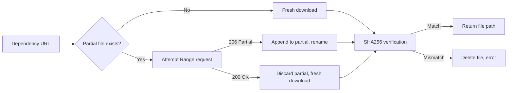

The condition evaluation system determines when dependencies and components need installation. It supports 20+ condition types across cross-platform and Windows-only categories, with Inno Setup compatibility aliases.

**Architecture:**
- **20+ condition types** — File, registry, architecture, env, service, OS version, Add/Remove Programs
- **Dual-backend HTTP** — WinHTTP (Windows, zero dependencies) or ureq (Unix)
- **Resumable downloads** — HTTP Range requests with `.partial` file tracking
- **SHA256 verification** — Integrity checking of all downloaded files
- **Priority ordering** — Dependencies installed in priority order (lower = first)

**Condition Types:**

*Cross-platform:*
| Condition | Description |
|-----------|-------------|
| `always` / `""` | Always true |
| `never` | Always false |
| `file_missing:<path>` | True if file doesn't exist |
| `file_exists:<path>` | True if file exists |
| `dir_exists:<path>` | True if directory exists |
| `arch:x86` / `arch:x64` / `arch:arm64` | Architecture check |
| `env:VAR_NAME` | True if env var is set and non-empty |
| `env_equals:VAR=value` | True if env var equals value |
| `is64bitos` / `is32bitos` | Inno Setup compatibility aliases |

*Windows-only:*
| Condition | Description |
|-----------|-------------|
| `registry_missing:HKLM\Software\...` | True if registry key absent |
| `registry_exists:HKLM\Software\...` | True if registry key exists |
| `registry_value_missing:HKLM\...\Val` | True if registry value absent |
| `registry_value_exists:HKLM\...\Val` | True if registry value exists |
| `not_installed:Product Name` | True if not in Add/Remove Programs |
| `installed:Product Name` | True if found in Add/Remove Programs |
| `winver_at_least:10.0` | True if Windows version >= specified |
| `service_exists:ServiceName` | True if Windows service exists |
| `service_running:ServiceName` | True if service is running |

**Add/Remove Programs Detection:**
```rust
// Checks both 64-bit and 32-bit uninstall keys
let paths = [
    r"SOFTWARE\Microsoft\Windows\CurrentVersion\Uninstall",
    r"SOFTWARE\WOW6432Node\Microsoft\Windows\CurrentVersion\Uninstall",
];
// Case-insensitive substring match on DisplayName
```

**Download Pipeline:**


**Platform HTTP Backends:**
| Platform | Backend | Notes |
|----------|---------|-------|
| Windows | WinHTTP | Zero external deps, Windows certificate store for TLS |
| Linux/macOS | ureq | Synchronous HTTPS via rustls/native-tls |

**Download Features:**
- Progress callbacks: `Fn(bytes_downloaded, total_bytes, url)`
- Filename sanitization: prevents path traversal, limits to 255 chars
- IPv6 support: bracket notation `[::1]:port`
- Timeout: 300s read, 30s write (Unix)
- HTTPS: Full certificate validation via platform trust store

**Dependency Resolution Flow:**
```rust
// 1. Evaluate condition for each dependency
// 2. Sort by priority (lower number = higher priority)
// 3. Download with resume + SHA256 verification
// 4. Execute installer silently with configured args
```

**Key files:**
- `crates/velocity-core/src/condition.rs` — 20+ condition evaluators (532 lines, 9 tests)
- `crates/velocity-core/src/dep_resolver.rs` — Condition-based dependency resolution
- `crates/velocity-core/src/dep_installer.rs` — Silent installation of dependencies
- `crates/velocity-core/src/downloader.rs` — HTTP download with resume (888 lines, 5 tests)

**Rules for developers:**
1. Windows-only conditions must return a clear error on Unix (not silently succeed)
2. All downloads must verify SHA256 when a hash is provided
3. Resume must handle servers that don't support Range (fall back to fresh download)
4. Add/Remove Programs search is case-insensitive substring match
5. Filename sanitization must prevent path traversal and null bytes
6. Registry paths in conditions use `ROOT\Sub\Key` format (parsed at runtime)
