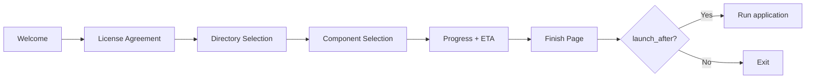

The Velocity Installer provides three UI backends for the installation wizard, selected by the `theme` field in `velocity.toml`. All backends share the same wizard flow but differ in rendering technology and platform support.

**Architecture:**
- **Theme selection** — `classic`, `modern`/`native`, `webview`/`webview2` in velocity.toml
- **Platform dispatch** — Windows uses Win32/WebView2, non-Windows uses wry+tao
- **Payload-aware wizard** — Modern/native themes can extract files in-wizard with real progress
- **Progress tracking** — Atomic progress counter with ETA calculation
- **Component selection** — User-selectable features with disk space calculation

**Theme Selection Logic:**
```rust
// crates/velocity-ui/src/wizard.rs
match manifest.ui.theme.as_str() {
    "classic" => run_classic(manifest),
    "modern" | "native" => run_native_with_payload(manifest, payload_data),
    "webview" | "webview2" => run_webview(manifest),
    _ => Err("Unknown theme"),
}

// Non-Windows always uses wry+tao
#[cfg(not(target_os = "windows"))]
return crate::wry_wizard::run_wry_wizard(manifest, payload_data, install_fn);
```

**Wizard Flow:**


**Wizard Result:**
```rust
pub struct InstallWizardResult {
    pub install_dir: PathBuf,
    pub cancelled: bool,
    pub launch_after: bool,
    pub selected_components: Vec<String>,
    pub install_completed: bool,  // true if wizard did extraction internally
}
```

**Backend Comparison:**

| Feature | Classic (Win32) | Modern/Native | WebView2 | wry+tao |
|---------|-----------------|---------------|----------|---------|
| Platform | Windows | Windows | Windows | Linux/macOS |
| Technology | Win32 API | Win32 + embedded HTML | Edge Chromium | webkit2gtk/WebKit |
| Themes | System default | Dark/Light CSS | Full CSS/JS | Basic HTML |
| Animations | None | CSS transitions | CSS animations | Minimal |
| RPC | None | JS↔Rust bidirectional | JS↔Rust bidirectional | Basic |
| Payload extraction | External | In-wizard | External | In-wizard |
| Dependencies | `windows` crate | `windows` crate | `webview2-com` | `wry`, `tao`, `gtk` |

**Progress Tracking:**
```rust
// Atomic counter for thread-safe progress updates
static PROGRESS: AtomicU64 = AtomicU64::new(0);

// Progress callback signature
fn(u32, String)  // (percent, status_message)
```

**Classic Wizard (Win32):**
- Uses Win32 dialog API via `windows` crate
- Native Windows look and feel
- Standard dialog controls (buttons, edit fields, list views)
- No external runtime dependencies

**Modern/Native Wizard:**
- Win32 window with embedded HTML content
- Dark/light theme support via CSS
- CSS animations for page transitions
- JS↔Rust bidirectional RPC for interactive elements
- HTML templates embedded via `wizard_html.rs`

**WebView2 Wizard:**
- Full Edge Chromium rendering via `webview2-com`
- Contemporary web-based UI
- CSS animations, flexbox/grid layouts
- JS↔Rust RPC for wizard navigation and data
- Requires WebView2 Runtime (Evergreen or Fixed)

**Cross-Platform Wizard (wry+tao):**
- `wry` for webview rendering
- `tao` for window management
- Linux: requires `libwebkit2gtk-4.1-dev` + `libgtk-3-dev`
- macOS: uses native WebKit
- Supports payload extraction with real progress via background thread

**Key files:**
- `crates/velocity-ui/src/wizard.rs` — Theme dispatch, InstallWizardResult (402 lines)
- `crates/velocity-ui/src/classic.rs` — Win32 native wizard
- `crates/velocity-ui/src/modern.rs` — Modern themed wizard
- `crates/velocity-ui/src/wizard_html.rs` — Embedded HTML templates
- `crates/velocity-ui/src/progress_dialog.rs` — Progress bar with ETA
- `crates/velocity-ui/src/native_wizard.rs` — Native Win32 wizard helpers
- `crates/velocity-ui/src/wry_wizard.rs` — Cross-platform wry+tao wizard
- `crates/velocity-ui/src/cross_platform.rs` — Cross-platform UI utilities

**Rules for developers:**
1. All wizard backends must return `InstallWizardResult` with the same semantics
2. Non-Windows builds must compile without `windows` crate features
3. Progress callbacks must be thread-safe (AtomicU64 or Mutex)
4. HTML templates must be self-contained (no external CDN dependencies)
5. The wizard must handle cancellation gracefully at every page
6. Component selection must calculate disk space before showing the page
