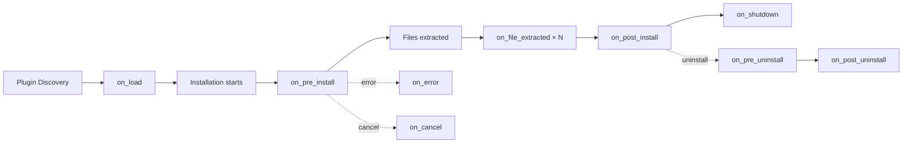

The Velocity Installer uses a WASM-based plugin system to extend installer behavior with sandboxed WebAssembly modules.

**Architecture:**
- **Sandboxed execution** — Plugins run in Wasmtime with no direct system access
- **9 lifecycle hooks** — Plugins can hook into every stage of installation
- **Host API** — Controlled access to logging, files, registry, commands, progress
- **Auto-discovery** — Drop `.wasm` + `plugin.json` in the `plugins/` directory
- **Safe by default** — No unsafe operations possible without explicit Host API grants

**Plugin Trait:**
```rust
// crates/velocity-plugin-api/src/plugin.rs
pub trait Plugin {
    /// Called when plugin is first loaded
    fn on_load(&mut self, ctx: &PluginContext) -> Result<()>;

    /// Called before installation begins
    fn on_pre_install(&mut self, ctx: &PluginContext) -> Result<()>;

    /// Called after each file is extracted
    fn on_file_extracted(&mut self, ctx: &PluginContext, path: &str) -> Result<()>;

    /// Called after installation completes
    fn on_post_install(&mut self, ctx: &PluginContext) -> Result<()>;

    /// Called when an error occurs during installation
    fn on_error(&mut self, ctx: &PluginContext, error: &str) -> Result<()>;

    /// Called when user cancels installation
    fn on_cancel(&mut self, ctx: &PluginContext) -> Result<()>;

    /// Called before uninstallation begins
    fn on_pre_uninstall(&mut self, ctx: &PluginContext) -> Result<()>;

    /// Called after uninstallation completes
    fn on_post_uninstall(&mut self, ctx: &PluginContext) -> Result<()>;

    /// Called when installer shuts down
    fn on_shutdown(&mut self, ctx: &PluginContext) -> Result<()>;
}
```

**Plugin Manifest (plugin.json):**
```json
{
    "name": "my-plugin",
    "version": "1.0.0",
    "description": "Example Velocity Installer plugin",
    "author": "Developer Name",
    "hooks": [
        "on_pre_install",
        "on_post_install",
        "on_error"
    ],
    "host_api": {
        "log": true,
        "read_file": true,
        "write_file": false,
        "exec_command": false,
        "registry_read": true,
        "registry_write": false,
        "set_progress": true
    }
}
```

**Wasmtime Loader:**
```rust
// crates/velocity-plugin-api/src/loader.rs
pub struct WasmLoader {
    engine: wasmtime::Engine,
    linker: wasmtime::Linker<PluginState>,
}

impl WasmLoader {
    pub fn new() -> Result<Self> {
        let engine = wasmtime::Engine::default();
        let mut linker = wasmtime::Linker::new(&engine);

        // Register Host API functions
        linker.func_wrap("env", "host_log", |caller: Caller<'_, PluginState>, ptr: i32, len: i32| {
            // Read string from WASM memory and log it
        })?;

        linker.func_wrap("env", "host_read_file", |caller: Caller<'_, PluginState>, path_ptr: i32, path_len: i32, buf_ptr: i32, buf_len: i32| -> i32 {
            // Read file and write contents to WASM buffer
        })?;

        // ... more Host API functions

        Ok(Self { engine, linker })
    }

    pub fn load_plugin(&self, wasm_path: &Path, manifest: &PluginManifest) -> Result<WasmPlugin> {
        let module = wasmtime::Module::from_file(&self.engine, wasm_path)?;
        let instance = self.linker.instantiate(&module)?;
        Ok(WasmPlugin { instance, manifest })
    }
}
```

**Host API Functions:**
| Function | Description | Parameters |
|----------|-------------|------------|
| `host_log` | Write to installer log | message: string |
| `host_read_file` | Read file contents | path: string → buffer |
| `host_write_file` | Write file contents | path: string, data: bytes |
| `host_exec_command` | Execute system command | cmd: string, args: string → exit_code |
| `host_registry_read` | Read registry value | key: string → value |
| `host_registry_write` | Write registry value | key: string, value: string |
| `host_set_progress` | Update progress bar | percent: f64 |
| `host_get_variable` | Read path variable | name: string → value |

**Plugin Discovery:**
```
plugins/
├── my-plugin/
│   ├── plugin.json    # Manifest (name, version, hooks, permissions)
│   └── plugin.wasm    # Compiled WASM module
└── another-plugin/
    ├── plugin.json
    └── another-plugin.wasm
```

**Lifecycle Flow:**


**Sample Plugin (WAT):**
```wat
;; examples/sample-plugin/plugin.wat
(module
  (import "env" "host_log" (func $log (param i32 i32)))
  (import "env" "memory" (memory 1))

  (func (export "on_load")
    ;; Plugin initialization
  )

  (func (export "on_pre_install")
    ;; Log a message before installation
    i32.const 0  ;; pointer to message
    i32.const 13 ;; length of message
    call $log
  )

  (data (i32.const 0) "Hello from WASM")
)
```

**Security Model:**
- Plugins cannot access the filesystem directly
- Plugins cannot execute commands without Host API permission
- Plugins cannot access the registry without Host API permission
- All Host API calls are mediated by the installer
- Wasmtime provides memory isolation (no buffer overflows)
- Plugin manifest declares required permissions

**Key files:**
- `crates/velocity-plugin-api/src/plugin.rs` — Plugin trait definition
- `crates/velocity-plugin-api/src/loader.rs` — Wasmtime loader and Host API
- `examples/sample-plugin/plugin.json` — Sample plugin manifest
- `examples/sample-plugin/plugin.wat` — Sample WASM plugin

**Rules for developers:**
1. All Host API functions must validate inputs from WASM
2. Plugins must declare required permissions in plugin.json
3. Default permissions should be minimal (log only)
4. Test plugins with malformed WASM to ensure sandbox holds
5. Document all Host API functions with parameter types and limits
